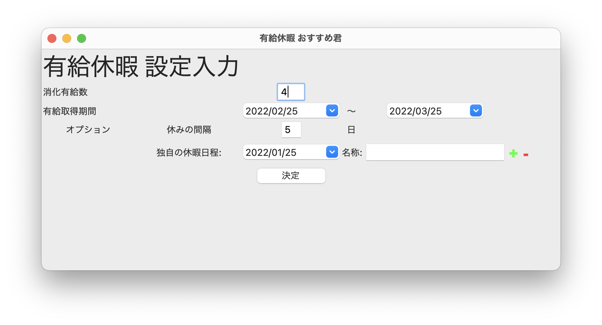
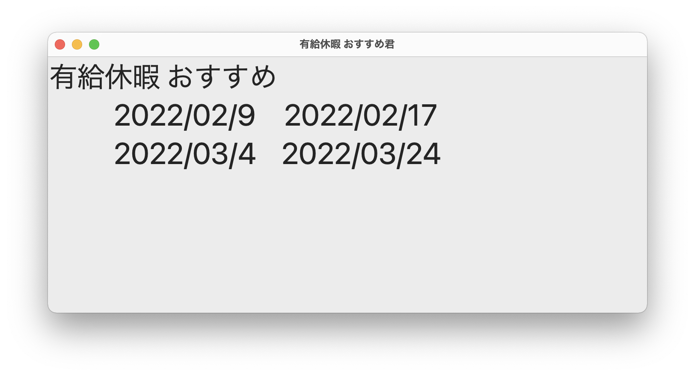

# ゆうきゅうくん

有給休暇をいつ取ればいいかわからない君へ

## Overview

一生懸命働くけれど、働いていると休むことを忘れてしまう。いざ疲れて休もうと思っても、すでに仕事の予定で埋まっていて有給休暇を滑り込ませる余地もない、、、

*そんな人にはこれ！*  
先までの有給休暇を取る日を決めてもらっちゃおう

## Usage

```
python3 app.py
```





## 開発途中

- 2022/02/10~2022/03/21のように取得期間を入れるが、現状は2022/02/01~2022/03/31に変換しちゃいます

- 独自の休暇はまだ使っていません

- 配置した新しい休暇同士が、入力した休暇の間隔以上に離れ合うようにするだけで、既存の休日と有給休暇の間隔を考慮していません